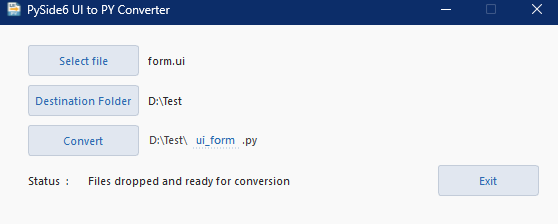

# UI2Py – PySide6 Edition

A simple yet powerful GUI tool to convert Qt Designer `.ui` files into Python code using **PySide6**.


## ✨ What's New (v1.2)
- **Drag & drop** `.ui` files directly into the window — instantly ready for conversion.
- **Segmented output path** (Prefix / **editable** Base / Suffix) with live width adjustment and custom styling.
- Smarter output name handling — defaults to `ui_form.py`, no need to type `.py`.
- Improved error messages:
  - Checks if `pyside6-uic` is available on PATH.
  - Clear permission and invalid path messages.
- On Windows, the conversion runs without showing a console window.


## ▶️ Usage

1. Open File — Click Select File or drag & drop a .ui file into the window.

2. (Optional) Select Destination Folder.

3. Edit Output Name — Click the middle segment of the output path (Base) to rename it.

4. Click Convert.

Status updates will appear at the bottom.
> 💡 *Tip:* If you type `name.py` in the editable box, the tool will remove `.py` automatically and add it back at the end.


## 🖼 Screenshots

### Main window (no file selected)


### After file selection (Prefix/Base/Suffix visible)


### Drag & drop success status message


### Editing the output name (focus underline)


### Conversion completed message


### After conversion (file created in selected folder)


## 🆘 Troubleshooting

- **`pyside6-uic not found on PATH`**  
  Make sure PySide6 tools are installed and your shell can run `pyside6-uic`.

- **No permission to write file**  
  Select a destination folder where you have write permissions (e.g., your user folder).

- **Wrong file type**  
  Only `.ui` files are supported.


## ⚡ Quick Setup (all-in-one)

If you just want to get started quickly, run these commands:

```bash
# Create a virtual environment
python -m venv .venv

# Activate the environment (Windows)
.venv\Scripts\activate

# Or activate it (macOS/Linux)
source .venv/bin/activate

# Install dependencies
pip install -r requirements.txt

# Run the app
python ui2py.py
```


## 🗺 Version Roadmap

| Version | Status | Planned Features |
|---------|--------|------------------|
| ✅ v1.0  | Released | Basic PySide6 GUI, single `.ui` to `.py` conversion |
| ✅ v1.1  | Released | Error handling, icon/taskbar visibility fix |
| ✅ v1.2  | Released  | Drag-and-drop support for `.ui` files |
| ⬜ v1.3  | Planned  | Multi-file batch conversion |
| ⬜ v1.4  | Planned  | Automatic dark/light mode, user settings panel |


## 📄 License

MIT © 2025 umitkrkmz
