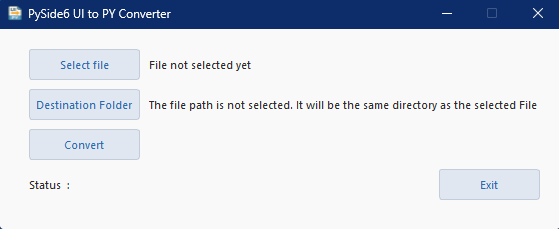
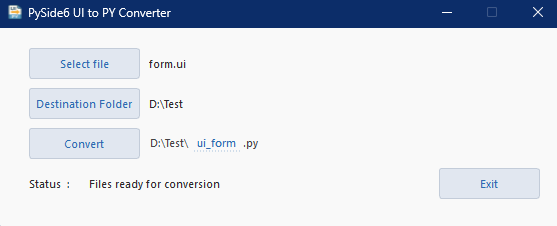
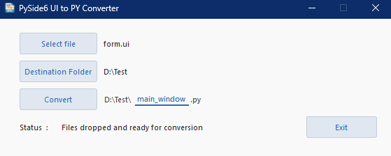

# UI2Py – PySide6 Edition

A simple yet powerful GUI tool to convert one or **multiple** Qt Designer `.ui` files into Python code using **PySide6**.


## ✨ What's New (v1.3)
- ✅ **Multi-file batch conversion:** You can now select and convert multiple `.ui` files at once!
  - Drag and drop multiple `.ui` files into the window — they’ll be listed automatically.
  - Each file is converted into `ui_<filename>.py` by default.
  
- ✅ **Dynamic UI resizing:** The window expands to show a file list when multiple files are dropped.

- ✅ **Smart output naming:** For batch conversion, each file is auto-named. For single file mode, you can manually edit the name.

- ✅ **Improved status feedback:** Clear, context-aware messages for both single and multiple file workflows.

## 📦 Version (v1.2)
- **Drag & drop** `.ui` files directly into the window — instantly ready for conversion.
- **Segmented output path** (Prefix / **editable** Base / Suffix) with live width adjustment and custom styling.
- Smarter output name handling — defaults to `ui_<filename>.py`, no need to type `.py`.
- Improved error messages:
  - Checks if `pyside6-uic` is available on PATH.
  - Clear permission and invalid path messages.
- On Windows, the conversion runs without showing a console window.


## ▶️ Usage

1.  **Select File(s)** — Click *Select File* or drag & drop one or more `.ui` files into the window.

2. **(Optional)** Select Destination Folder.

3. **(Optional, single file only)** Edit Output Name — Click the middle segment (Base) to rename it.

4. Click **Convert**.

Status updates will appear at the bottom.
> 💡 *Tip:* When converting multiple files, each one is automatically named as `ui_<filename>.py`.


## 🖼 Screenshots

### Main window (no file selected)


### After file selection (Prefix/Base/Suffix visible)


### Drag & drop success status message


### Editing the output name (focus underline)


### Conversion completed message


### After conversion (file created in selected folder)


### After dropping multiple files


### After conversion multiple files (file created in selected folder)


## 🆘 Troubleshooting

- **`pyside6-uic not found on PATH`**  
  Make sure PySide6 tools are installed and your terminal can run `pyside6-uic`.

- **No permission to write file**  
  Choose a folder where you have write permissions (e.g., your home or desktop folder).

- **Wrong file type**  
  Only `.ui` files are supported.

- **Mixed file types dropped**  
  Only `.ui` files will be processed. Other file types will be ignored.

- **Duplicate output names**  
  Output names are auto-generated as `ui_<filename>.py`. Ensure all input filenames are unique to avoid overwriting.


## ⚡ Quick Setup (all-in-one)

To get started quickly:

```bash
# Create a virtual environment
python -m venv .venv

# Activate the environment (Windows)
.venv\Scripts\activate

# Or activate it (macOS/Linux)
source .venv/bin/activate

# Install dependencies
pip install -r requirements.txt

# Run the app
python ui2py.py

# Tip: You can drag & drop multiple .ui files into the app window.
```

## 🗺 Version Roadmap

| Version | Status | Planned Features |
|---------|--------|------------------|
| ✅ v1.0  | Released | Basic PySide6 GUI, single `.ui` to `.py` conversion |
| ✅ v1.1  | Released | Error handling, icon/taskbar visibility fix |
| ✅ v1.2  | Released | Drag-and-drop support for `.ui` files |
| ✅ v1.3  | Released | Multi-file batch conversion |
| ⬜ v1.4  | Planned  | Automatic dark/light mode |


## 📄 License

[MIT © 2025 umitkrkmz](LICENSE)
